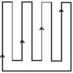

# CRABI Coding Interview
The set of tasks is only partially defined. Use your judgment to complete them, ensuring a balanced approach without spending excessive time on any single problem. The goal is to assess how you handle ambiguity, scope tasks, and make decisions in such scenarios.  

We expect you to use version control effectively to track progress and iteratively develop your repository over time. Your evaluation will be based on:  

- Your ability to explain and communicate concepts clearly.  
- How quickly you learn and apply new concepts.  
- Your coding proficiency and style.  
- Your usage of Git for version control.  

Avoid over-optimizing solutions from the outset; instead, focus on incremental improvement and adaptability.

## Problem Statement
Suppose you have two systems that provide position and orientation of a robot on
a 2D plane moving in a lawn mower pattern shown below.



System 1 is fixed to the ground, and System 2 is attached to the robot. System 1
outputs values at roughly 2.5  Hz, and System 2 at roughly 100 Hz. Both systems
have a certain accuracy. The system designers claim that System 1 is twice as accurate as System 2. 

The spatial transformation of System 1 with respect to System 2 at a time $t_0$  is
given by $T_2^1$. Assume both systems start to measure at this same time. 
The origin of System 1 is at [10, 10, 100], with respect to a Global Coordinate Frame (GCF).
Each system provides measurements in the format [t, p_x, p_y, θ_z].

## Time Allocated:
1. You will have **3 days** to complete the task. After this period, access to the repository will be revoked.
2. If you finish earlier, please send us an email to notify us of your submission.
3. If you require an extension of **one or two** days, don’t hesitate to request additional time.
4. You are allowed to use any libraries. 

**Note**: We think the project should take you **no more than 4-5 hours of uninterrupted
time** to finish for a satisfactory submission. If you want to develop it
further, it is your choice. Be mindful of the final submission deadline, if you
want to invest more time in building this project. 

**Donot use ChatGPT to write your code and blindly copy paste it. You may get assistance from any source but don't copy it directly**

## Task Overview
### Documentation (DOC.md)
1. Create a `DOC.md` file that explains your reasoning behind the implementation.
2. The file may include diagrams, sketches, and mathematical formulations used in your approach.

## Submission
1. **Branching**: Create your own branch to work on the task. Push all your code and updates to this branch.
2. **Merge Request**: Once you have completed your work, create a pull request request for review.

### Position Computation Script
0. Simulate motion data for the lawn mower pattern with noisy measurements. Make
appropriate assumptions for noise models.
1. Develop a Python script (or choose scripting language of your choice) to
process data from these two systems and compute the robot’s position in the Global Coordinate Frame (GCF).
2. If using code snippets from public sources, include proper references within the code.
3. Assume reasonable values for missing variables where necessary.
4. Organize your code in a structured manner. Provide usage instructions file demonstrating example usage of your script.

### Automated Testing
1. Implement automated tests in `tests` folder using an appropriate testing framework to validate your code’s functionality. 100% coverage is not required.

### Bugs/Code Fixes
1. Report any known issues and bugs in your code in `ISSUES.md`

### Future modifications
- If this problem were extended to 3D (where the robot moves in a full 6-DoF space and both systems provide complete pose information), describe the design changes required to accommodate this in `TODO.md`.
- How would you make your code more flexible to acommodate future changes? Your design should be able to accomodate future changes.

### Bonus Challenges 
You may choose to attempt one of the following:

1. **Python Package**: Convert your implementation into a Python package, considering package structure, CI/CD, and CLI functionality.
2. **ROS Package**: Implement a ROS package with appropriate topics, launch files, and a well-thought-out system design.
3. **C++ Port**: Rewrite the solution in C++ and use CMakeLists.txt to manage compilation.

### Solution

```
Your solution starts here
Add links to all the documents in this readme file. 
Write usage instructions below
```

