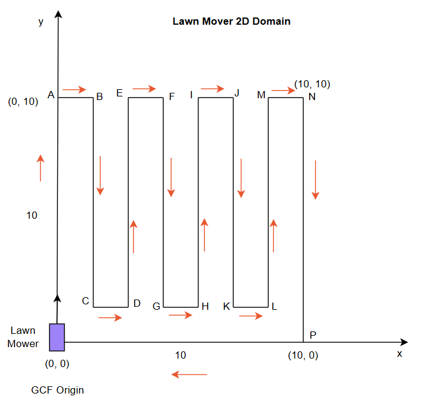
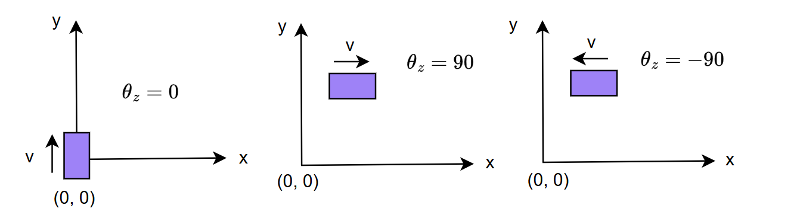
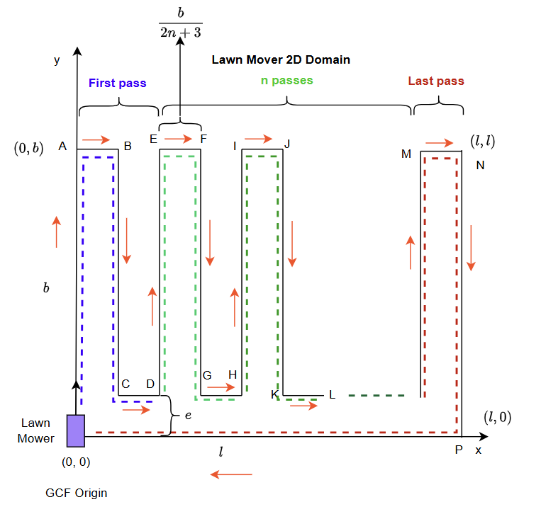
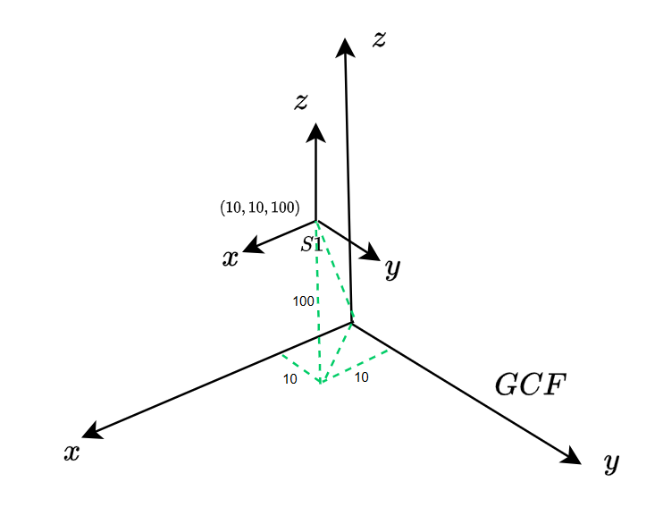
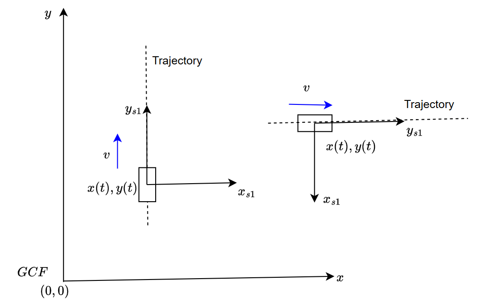

# Documentation [Soham]

## Problem 
Here, I describe what is given to us in the problem, what assumptions we make, the thinking process behind making those assumptions, and the overall implementation strategy. 

### Lawn-Mower Domain

We have the following 2D domain, where the lawn mover operates:


We make the following assumptions and calculations based on that.
1. Length of the domain: 10 m
2. Breadth of the domain: 10 m
3. Origin of the Global Co-ordinate Frame (addressed as GCF from now on): (0, 0), with the $x$ and $y$ directions marked as shown in the figure.
4. The initial time for the simulation is $t_0 = 0$
5. The bot at $t_0$ is at the GCF origin (0, 0). And starts moving along the $y$-axis. 
6. It follows the trajectory marked by the orange colored arrows, and reaches the origin back, mowing the lawn in the process. The vertices in the trajectory are labelled $A$ through $P$, with $O$ representing the origin.
7. We assume that the lawn mower moves at a constant velocity of $2 m/s$.

## Systems: Observers

We have 2 systems which provide us information about the bot's location and orientation, in the following format: $t, p_x, p_y, \theta_z$, where $t$ denotes the time, $p_x, p_y$ denote the $x$ and $y$ co-ordinates, and $\theta_z$ denotes the orientation, measured with respect to the GCF. The angle is measured with a right-handed co-ordinate system, and to clarify the angle measurement convention, the examples are shown below: 



Some specifications about the system are given as follows: (addressing System 1 and System 2 as S1, and S2 from here on, for simplicity)
| Criterion | S1 | S2 |
| --------- | -- | -- |
| Update Rate | 2.5 Hz | 100 Hz |
| Mounting Location | Fixed at (10, 10, 100) | Moves with LawnMower |
| Accuracy | 2x Base level | Base Level |
| Start of Measuring Time | $t_0 = 0$ | $t_0 = 0$ |

### System Accuracy
The problem mentions that S1 is twice as much accurate as S2. We need to quantify this accuracy using a metric. Usually we represent measurement systems or sensor accuracy using error models and noise covariances. Lets define the standard deviations of the systems in a relative manner:
1. Let $\sigma_2$ be the standard deviation of the noise in S2. 
2. Similarly, let $\sigma_1$ be the standard deviation of the noise in S1. 
3. Since S1 is twice as accurate: $ \sigma_1 = \frac{\sigma_2}{2}$
4. We also assume that the **noise models are independent for each parameter**. Basically noise in measuring the $x$ position, does not affect the measurement noise of $y$ position and $\theta_z$ orientation. Hence the measurement covariances for each of the systems would be as follows:
$ C_1 = \begin{bmatrix} \sigma^2_{1, x} & 0  & 0\\
                         0 & \sigma^2_{1, y} & 0 \\
                         0 & 0 & \sigma^2_{1, \theta} \\
                         \end{bmatrix} \hspace{2pt}$

    $C_2 = \begin{bmatrix} \sigma^2_{2, x} & 0  & 0\\
                         0 & \sigma^2_{2, y} & 0 \\
                         0 & 0 & \sigma^2_{2, \theta} \\
                         \end{bmatrix}
$
5. Here, we assume some values for the standard deviations for each systems S1, and S2 with measurement noises for each parameter:

    | Parameter | S1 | S2 |
    | --------- | -- | -- |
    | $p_x$ | $\sigma_{1, x}$ = 0.05 m | $\sigma_{2, x}$ = 0.1 m |
    | $p_y$ | $\sigma_{1, y}$ = 0.05 m | $\sigma_{2, y}$ = 0.1 m |
    | $\theta_z$ | $\sigma_{1, \theta_z}$ = $0.5^{\circ}$ | $\sigma_{2, \theta_z}$ = $1^{\circ}$ |

## Robot Dynamics
Next, we work on the dynamics model of the lawn mower. To emulate the measurements from S1, S2, we will first simulate the trajectory followed by the lawn mower and then superimpose it with the noise models, defined in the previous section. We will consider a simple constant velocity model in both the $x$ and $y$ directions. The orientation variable will change values only at the vertices and will remain constant at all other times. The following equations describe the trajectory. We represent them in tables, so it becomes easier to visualize. Before going ahead with the trajectory simulation, we also assume that:
1. $\ell(AO) = \ell(NP)$ 
2. $\ell(BC) = \ell(DE) = \ell(FG) = \ell(HI) = \ell(JK) = \ell(ML)$
3. $\ell(AB) = \ell(CD) = \ell(EF) = \ell(GH) = \ell(IJ) = \ell(KL) = \ell(MN)$
4. Lets approach this problem algorithmically.
5. The figure has 3 repeated looping passes, and then the last maneuver which reaches the original position which can be parameterized as follows: (S == Straight, R == Right, L == Left)

| Action | Start Destination | End Destination |
| ------ | ----------------- | --------------- |
| S | O/D/E | A/E/I |
| R | A/E/I | A/E/I |
| S | B/F/J | B/F/J |
| R | B/F/J | B/F/J |
| S | C/G/K | C/G/K |
| L | C/G/K | C/G/K |
| S | D/H/L | D/H/L |
| L | D/H/L | D/H/L |

And then we have the last pass as:
| Action | Start Destination | End Destination |
| ------ | ----------------- | --------------- |
| S | L | M |
| R | M | M |
| S | N | N |
| R | N | N |
| S | P | P |
| R | P | P |
| S | O | O |
| R | O | O |

In the first pass of the repeated passes: the distances are a bit different than the other repeated passes, since one arm is different.
### First Pass: 
- Time offset: 0
- X offset: 0

| Action | Parameter Value | Time Elapsed | Total Time |
| ------ | --------------- | ------------ | ---------- |
| S | $y: 0 \rightarrow 10$; $x = 0$, $\theta_z = +90$ | 10 | 10 |
| R | $\theta_z: +90 \rightarrow 0$, $y = 10$, $x = 0$ | 0 | 10 |
| S | $x: 0 \rightarrow  1.428$, $y = 10$, $\theta_z = 0$ | 1.428 | 11.428 |
| R | $\theta_z: 0 \rightarrow -90$, $x = 1.428$, $y = 10$ | 0 | 11.428 |
| S | $y: 10 \rightarrow 1$, $x = 1.428$, $\theta-z = -90$ | 9 | 20.428 |
| L | $\theta_z: -90 \rightarrow 0$, $x = 1.428$, $y = 1$ | 0 | 20.428 |
| S | $x: 1.428 \rightarrow 2.856 $, $y = 1$, $\theta_z = 0$ | 1.428 | 21.856 |
| L | $\theta_z: 0 \rightarrow +90$, $x = 2.856$, $y=1$ | 0 | 21.856 | 

### Second and Third Pass:
- Time offset: 21.856 (for second pass), 21.856+20.856 (for third pass)
- X offset: 21.856 (for second pass), (21.856+20.856) (for third pass)

| Action | Parameter Value | Time Elapsed | Total Time (add time offset while actual computation)|
| ------ | --------------- | ------------ | ---------- |
| S | $y: 1 \rightarrow 10$, $x = 0$, $\theta_z = +90$ | 9 | 9 |
| R | $\theta_z: +90 \rightarrow 0$, $y = 10$, $x = 0$ | 0 | 9 |
| S | $x: 0 \rightarrow  1.428$, $y = 10$, $\theta_z = 0$ | 1.428 | 10.428 |
| R | $\theta_z: 0 \rightarrow -90$, $x = 1.428$, $y = 10$ | 0 | 10.428 |
| S | $y: 10 \rightarrow 1$, $x = 1.428$, $\theta-z = -90$ | 9 | 19.428 |
| L | $\theta_z: -90 \rightarrow 0$, $x = 1.428$, $y = 1$ | 0 | 19.428 |
| S | $x: 1.428 \rightarrow 2.856 $, $y = 1$, $\theta_z = 0$ | 1.428 | 20.856 |
| L | $\theta_z: 0 \rightarrow +90$, $x = 2.856$, $y=1$ | 0 | 20.856 | 

### Last Pass
- Time offset: 21.856 + 20.856 + 20.856
- X offset: 21.856 + 20.856 + 20.856

| Action | Parameter Value | Time Elapsed | Total Time (add time offset while actual computation)|
| ------ | --------------- | ------------ | ---------- |
| S | $y: 1 \rightarrow 10$, $x = 0$, $\theta_z = +90$ | 9 | 9 |
| R | $\theta_z: +90 \rightarrow 0$, $y = 10$, $x = 0$ | 0 | 9 |
| S | $x: 0 \rightarrow  1.428$, $y = 10$, $\theta_z = 0$ | 1.428 | 10.428 |
| R | $\theta_z: 0 \rightarrow -90$, $x = 1.428$, $y = 10$ | 0 | 10.428 |
| S | $y: 10 \rightarrow 0$, $x = 1.428$, $\theta-z = -90$ | 9 | 19.428 |
| R | $\theta_z: -90 \rightarrow -180$, $x = 1.428$, $y = 0$ | 0 | 19.428 |
| S | $x: 10 \rightarrow 0 $, $y = 0$, $\theta_z = -180$ | 10 | 29.428 |
| R | $\theta_z: -180 \rightarrow +90$, $x = 0$, $y=0$ | 0 | 29.428 | 

## Generalized Robot Dynamics
Here, we have considered a very particular case of the motion simulation. In the event that the field is not symmetric then a parameterized trajectory is not useful. It will be then better to store the known trajectory in discrete set of known points, and then interpolate. However if the symmetry is still present, then we can generalize this trajectory parameterization. 

> We do not address the case which lacks symmetry for now. Currently we only focus on trajectorties which have some level of symmetry.



Lets parameterize the following generalized serpentine trajectory: the following assumptions still hold:
1. $\ell(AO) = \ell(NP)$ 
2. $\ell(BC) = \ell(DE) = \ell(FG) = \ell(HI) = \ell(JK) \ldots = $ and so on
3. $\ell(AB) = \ell(CD) = \ell(EF) = \ell(GH) = \ell(IJ) = \ell(KL) = \ldots = \ell(MN)$

Here, too we can use a similar action-world pair, where each action has a physical impact on the robot's position and orientation, and form a parameterized trajectory. However for now, we leave that as an advanced topic. 

## Sensor Simulation
So far, we have simulated the robot motion along the serpentine trajectory and also modeled our observation/measurement systems or we can call them as sensors. Hence we already have the ground truth in the Global Co-ordinate frame, now we need to simulate Sensor measurements in their respective frames of reference. We now incorporate a sensor model to capture the noise measurements as well apply frame transformations so that we can emulate the observations/measurements performed by System 1 and 2: with the noise as well their location and frame of reference.
So there are 2 parts to the sensor simulation exercise: 
- Noise incorporation
- Sampling rate incorporation
- frame of reference incorporation

### Incorporating Sensor Sampling Rate
We have generated the ground truth by considering some time interval value, however for each sensor, we have been given a sampling rate or update rate in Hz: which is number of measurements per second. Because of the difference in the sampling rates in the ground truth and the sensor measurement rate, we will need to interpolate values in order to simulate sensor measurement. 

**An easy solution would be just matching the update rates of ground truth generation and the sensor update rate. However, in the real world, we have lots of different sensors with varying degrees of accuracy and update rates, hence in order for our system to be robust, the sensor should work in all possible use cases.**

#### Interpolation
Lets have a quick look at how interpolation works and why it is useful. Consider that you know the time and x co-ordinate of the robot at 2 different moments, $t_1, x_1$ and $t_2, x_2$. Now if we want to find the x-co-ordinate at a new time, say $t_1 \leq t_{new} \leq t_2$, how do you go about it?

The simplest technique to use is Linear Interpolation: it makes a very simple assumption, that the value of $x$ changes linearly with time, i.e in a straight line between 2 points. Hence what we can do is, first find the slope of the line: 
$ slope (s)= \frac{(x_2 - x_1)}{(t_2 - t_1)}$, and then form the equation of the line: 
$ x - x_1 = s * (t - t_1)$, from this new equation, we can solve for $x$ at $t_{new}$, which is as follows:
$x_{new} = x_1 + s*(t_{new} - t_1)$. This is how you can interpolate to find values where the samples do not exist. The same interpolation logic is used for interpolating ground truth values to compute robot co-ordinates to match the sensor update rates. 

### Frame of Reference
The ground truth is measured in the Global Co-ordinate frame which is centered at the origin of the lawn field, and the orientation of the $x$ and $y$ axes can be seen from the figures. It is a right handed system, so the $+z$ points outside from the screen you are looking at, towards you. System 1's frame of reference, is fixed at co-ordinates $(10, 10, 100)$, and does not translate as well as rotate, and also is a right-handed system.

The following figure visualizes how the System S1 is placed relative to GCF:



hence, we have the following transformation

1. $x_{S1} = x_{GCF} - 10$
2. $y_{S1} = y_{GCF} - 10$
3. $z_{S1} = z_{GCF} - 100$
4. $\theta_{z, S1} = \theta_{z, GCF}$

The last one, i.e the heading angle will be same, since heading angle is calculated as the total rotation around the $z$-axis, in the anti-clockwise direction, according to right hand thumb rule. 

Similarly, the following figure visualizes how the System S2 is placed relative to GCF: (note that the frame moves and rotates along with the robot along the trajectory)



hence, we have the following transformation
1. $x_{S2} = x_{GCF} - x(t) = 0$
2. $y_{S2} = y_{GCF} - y(t) = 0$
3. $z_{S2} = z_{GCF} - z(t) = 0$
4. $\theta_{z, S2} = +90$

If you observe closely the co-ordinates of the robot, in a reference frame attached to itself will always be zero. And the heading angle will always be constant as +90. 

**Think like this: In a frame of reference attached to a robot doing uniform unaccelerating motion, the world around it is moving, while the robot is always at rest. Imagine sitting inside a car. No matter how much the car turns, in your own body frame, you are always facing forward. The whole world moves around you, but your own heading is always 0 in your own frame.**

### Noise Models
We first interpolate the data to match the sensor update rates, and then we transform the ground truth into the sensor specific frames of reference, after this we add the noise values: Gaussian distributions centred at zero, with a non-zero standard deviation, numerically valued according to the sensor accuracy. In the following table we quantify the noise values for each sensor, and each quantity. *It is given in the problem, that each of the sensors start measuring time at the same instant. And additionally we assume that there are no errors in measuring time, hence we now that the sensors are perfectly aligned in time.*

| Parameter Name | $\sigma_{S1}$ | $\sigma_{S2}$ |
| -------------- | ------------- | ------------- |
| $p_x$ | $\sigma_{1, x}$ = 0.05 m | $\sigma_{2, x}$ = 0.1 m |
| $p_y$ | $\sigma_{1, y}$ = 0.05 m | $\sigma_{2, y}$ = 0.1 m |
| $\theta_z$ | $\sigma_{1, \theta_z}$ = $0.5^{\circ}$ | $\sigma_{2, \theta_z}$ = $1^{\circ}$ |

## State Estimation via Extended Kalman Filtering & Sensor Fusion

Kalmanm filtering is an elegant way of state estimation. Now, we already have obtained the estimated states by each of the systems, ```S1``` and ```S2```, stored in S1. 
```bot.trajectory``` contains the ground truth trajectory of the robot in the GCF, whereas ```S1.converted_traj_gcf``` and ```S2.converted_traj_gcf``` contains the trajectory measurements done by S2, both transformed from the respective sensor frames to the GCF. Hence the measurement part is complete, and we need to devise a strategy to fuse these sensor outputs. 

### Sensor Fusion Strategy
Consider the system state as $\overrightarrow{s} = [x, y, z, \theta]$, and the motion model we use is as follows:

$ x_{k+1} = x_k + v_{x, k} dt + \frac{1}{2}a_{x, k} dt^2 $

$ y_{k+1} = y_k + v_{y, k} dt + \frac{1}{2}a_{y, k} dt^2 $

$ z_{k+1} = x_k + v_{z, k} dt + \frac{1}{2}a_{z, k} dt^2 $

$ \theta_{k+1} = tan^{-1}(\frac{v_y}{v_x}) $

The strategy for the sensor will be as follows:
1. Each sensor will have different sampling rates i.e, Sensor S1 and Sensor S2 must record data at different time steps. The fusion algorithm must align them correctly in time. 
2. The sensors might have different accuracy, and hence the fusion algorithm must weigh their inputs accordingly. 
3. There might be some missing data, or uneven time stamps: some timestamps may be missing in one sensor, and the algorithm must interpolate for unavailable data.

The fusion strategy will follow the steps:
1. Interpolate the ground truth, and sensor data to a common time grid: so that at the timestamps where the sensor data is not available, interpolation should be done. 
2. Compute a weighted estimate for each timestamp, and the weights will be according to the aaccuracy of the sensor, captured with the value of the standard deviations. 
3. We can also apply a Kalman filter after this, for smoother, consistent results, where the process model is the trajectory, and the fused sensor measurements are noisy observations. 

### Error Metrics
We define a couple of error metrics as follows:
1. Mean Squared Error: MSE: $\frac{1}{N} \sum^N_{i=1} (X_{fused}(t_i) - X_{true}(t_i))^2$
2. Root Mean Squared Error: RMSE: $\sqrt{MSE}$
3. Mean Absolute Error: MAE: $\frac{1}{N}\sum^N_{i=1}| X_{fused}(t_i) - X_{true}(t_i)|$
4. Max Absolute Error: $max|X_{fused}(t-i) - X_{true}(t_i)|$

## Test
We have a lot of parameters to vary in this simulation framework. But we focus mainly on the functional utility of the framework and test the important functional blocks for their accuracy. The following are the important functional blocks for the framework. 

1. Trajectory generation for the robot: acts as ground truth
2. Sensor simulation: which simulates measurements from sensors
    - does timestamp matching to adjust for difference in update rates of ground truth and sensor
    - incorporates noise via noise models
    - transforms from GCF to sensor and vice versa
3. Sensor Fusion: Fuses the data from both sensors to create the finalized output